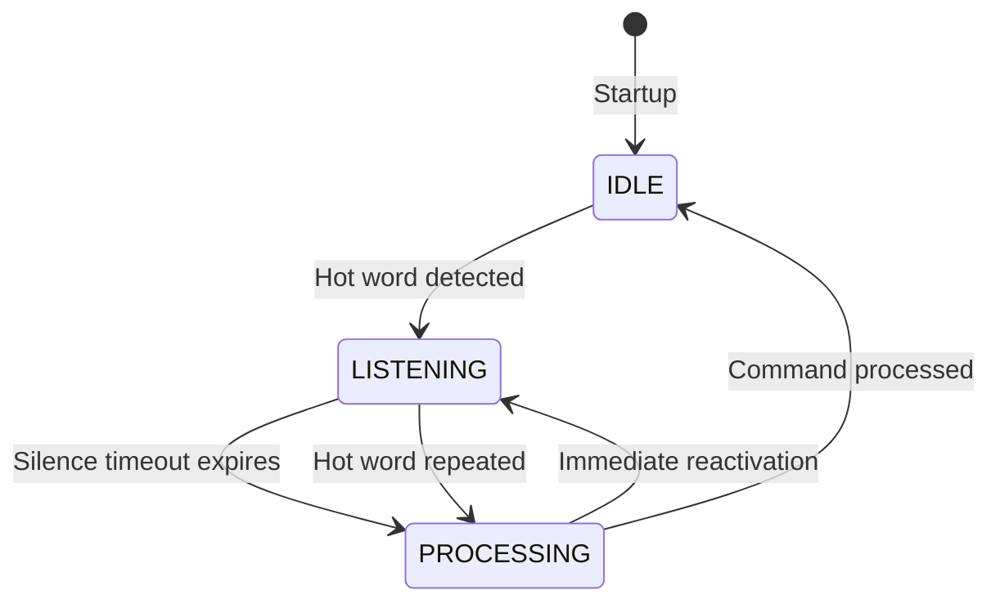

# Design Document - Native Audio Bridge

**Project:** native-audio-bridge  
**Design ID:** NP-001  
**Author:** Zack (Developer Agent)  
**Date:** 2026-04-12  
**Version:** 1.0  

---

## 1. System Overview

A native macOS voice interaction layer consisting of:

### 1.1 Core Components
- **AudioBridge**: Swift application with always-on mic monitoring
- **State Manager**: Orchestrates state transitions (IDLE → LISTENING → PROCESSING → DISPATCH)
- **HotWordDetector**: Uses SFSpeechRecognizer with pattern matching
- **CommandProcessor**: Captures audio after hot word until silence detected
- **WebhookDispatcher**: Sends command text to OpenClaw via configured endpoint
- **TTSEngine**: Handles text-to-speech output

### 1.2 Processing Pipeline
1. **Audio Capture**: AVAudioEngine continuously captures microphone input
2. **Speech Recognition**: SFSpeechRecognizer provides partial results
3. **Hot Word Detection**: Pattern match against transcriptions ("hey claW")
4. **Command Encoding**: Buffer audio upon detection, capture until silence
5. **Transcription**: Final STT for buffered command audio
6. **Dispatch**: Send via webhook or write to configured output

---

## 2. State Management

### 2.1 Finite State Machine


### 2.2 State Logic
- **IDLE**: Low-power mode, monitoring audio stream
- **LISTENING**: Processing partial transcriptions for hot word
- **PROCESSING**: Capturing command audio after hot word detection
- **PROCESSING (SILENCE)**: Monitoring for silence to end command capture

---

## 3. Technical Architecture

### 3.1 Audio Stack
- **AVAudioEngine**: Manages continuous microphone input
- **AVAudioInputNode**: Tap on input bus for raw audio access
- **SFSpeechRecognizer**: Speech recognition engine
- **AudioBuffer**: In-memory storage for command capture

### 3.2 Transcription Flow
1. AVAudioEngine sends audio buffers to SFSpeechRecognizer
2. SFSpeechRecognizer returns partial recognitions
3. HotWordDetector monitors transcriptions for wake phrase
4. Upon detection, CommandBuffer starts recording
5. Timeout mechanism monitors audio levels to end capture
6. Final transcription generated from captured buffer

---

## 4. Hot Word Detection

### 4.1 Pattern Matching
- Case-insensitive matching against "hey claW"
- Listen to partial transcriptions from SFSpeechRecognizer
- Use sliding window matching for robustness

### 4.2 Alternative Wake Phrases
Future support for additional phrases via configuration:
- "hey coffee"
- "hey zack"
- Custom user-defined phrases

---

## 5. Command Capture & Processing

### 5.1 Audio Buffering
- Circular buffer with configurable duration
- Automatic expansion as needed
- Stop conditions: silence > 1.5s or buffer limit

### 5.2 Silence Detection
- Root mean square (RMS) level monitoring
- Moving average of audio energy
- Threshold-based detection (configurable)

### 5.3 Command Execution
- Transcribe captured audio with SFSpeechRecognizer
- Sanitize and validate command
- Dispatch via webhook or log output

---

## 6. Webhook Integration

### 6.1 Payload Format
```json
{
  "message": "Command text here",
  "name": "AudioBridge",
  "agentId": "audio-bridge",
  "wakeMode": "now"
}
```

### 6.2 Authentication
- **Header**: `Authorization: Bearer <personal_token>`
- Token generated via: `openclaw keys generate --scope webhooks`
- Token stored in keychain or secure credential store

### 6.3 Error Handling
- **Retries**: Exponential backoff (1s, 2s, 4s) up to 3 attempts
- **Failures**: Notify user via OpenClaw webhook on persistent failure
- **Fallback**: Queue commands for later delivery when connectivity restored

---

## 7. Output Destinations

### 7.1 Primary: OpenClaw Webhook
- Configured via settings file
- Supports multiple webhook endpoints
- Stanford-compliant request format

### 7.2 Secondary: JSONL File Logging
- Configurable file path and rotation
- Append-only format with timestamp prefix
- Automatically closed and rotated based on size or time

### 7.3 Output Switching
- Configurable output destination
- Zero-cost switch at runtime
- Atomic file operations

---

## 8. Configuration System

### 8.1 Settings Format
```yaml
# ~/.native-audio-bridge/config.yaml
hot_word: "hey claW"
silence_timeout: 1500
output_destination: "webhook"  # or "jsonl_file"
jsonl_path: "~/audio-bridge.log"
webhook_url: "https://gateway.openclaw.io/hooks/agent"
webhook_token: "{{autogenerated_token}}"
max_memory_mb: 80
retry_attempts: 3
retry_base_delay_ms: 1000
```

### 8.2 Configuration Management
- YAML parsing with default fallbacks
- Runtime reload support
- Secure token handling
- Atomic writes for configuration changes

---

## 9. Security & Privacy

### 9.1 Data Handling
- **Audio Data**: Strictly in-memory, never persisted
- **Command Text**: Processed and dispatched, then discarded
- **Logs**: Only stored if explicitly configured
- **Tokens**: Generated via OpenClaw key management

### 9.2 Privacy Guarantees
- No audio persistence to disk
- Memory-only processing during runtime
- Automatic zeroization of buffers
- No network calls to external APIs

---

## 10. Performance Characteristics

| Metric | Target | Measurement |
|--------|--------|-------------|
| CPU Usage | < 5% | Instruments profiling |
| Memory Usage | < 80MB | Allocation tracking |
| Latency | < 1s | End-to-end timing |
| Power Draw | Minimal | System-level monitoring |

---

## 11. Testing Strategy

### 11.1 Unit Tests
- Component-level functionality
- Edge case handling
- Error path coverage

### 11.2 Integration Tests
- Full pipeline from audio capture to dispatch
- Network failure simulations
- Configuration edge cases

### 11.3 Performance Benchmarks
- Stress testing with continuous operation
- Resource usage monitoring
- Latency under load

---

## 12. Future Enhancements (Phase 2)

1. **Adaptive Silence Detection**: Moving average approach for context-aware timeout
2. **Multiple Wake Words**: Support for user-defined phrases
3. **Advanced Pause Reasoning**: Differentiate sentence breaks from command termination
4. **Cross-Platform Support**: Extend to iOS with shared codebase
5. **AI Model Optimization**: Integrate WhisperKit fallback options
